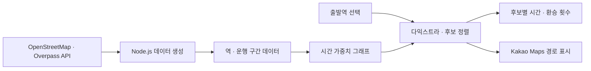

# subway-midpoint

**여러 사람의 출발역을 받아 가장 오래 이동하는 사람의 부담을 줄이는 지하철 중간역을 추천하는 사이드 프로젝트입니다.**

React·TypeScript로 역 검색, 후보 비교와 지도 경로 표시를 연결했습니다. 노선의 분기·순환·환승을 데이터로 표현하고, 계산 로직을 UI에서 분리해 테스트할 수 있도록 구성했습니다.

[서비스](https://minsangkwak.github.io/subway-midpoint/) · [개발 미리보기](https://minsangkwak.github.io/subway-midpoint/dev/) · [개발 가이드](docs/DEVELOPMENT.md) · [운영·배포](docs/OPERATIONS.md)

> 문서 기준: 2026-09-27. 수도권 전철 1~9호선의 OpenStreetMap 데이터를 사용합니다. 소요시간은 거리와 환승 비용으로 계산한 추정값입니다.

## 프로젝트 한눈에 보기

| 항목 | 내용 |
| --- | --- |
| 해결하려는 문제 | 지도상의 가운데가 실제 이동 부담까지 고르게 나누지는 않는 문제 |
| 주요 사용자 | 서로 다른 역에서 출발해 만날 장소를 정하려는 사람들 |
| 주요 기능 | 출발역 2~6곳 검색, 상위 후보 3개 비교, 출발지별 예상 시간·환승 횟수·경로 표시 |
| 추천 기준 | 출발역을 제외한 후보에서 최대 예상 시간 최소화 → 전체 시간 합계 → 역 이름순 |
| 프론트엔드 | React 19 · TypeScript · Vite 7 · CSS Modules |
| 데이터·지도 | OpenStreetMap · Overpass API · Kakao Maps SDK |
| 품질·배포 | Vitest · ESLint 9 · GitHub Actions · GitHub Pages |

## 검토할 만한 구현

어떤 문제를 어떻게 해결했는지 관련 코드와 함께 확인할 수 있습니다.

| 문제 | 구현한 접근 | 확인할 근거 |
| --- | --- | --- |
| 배열 순서로 역을 연결하면 분기에서 잘못된 간선이 생김 | 역 노드와 운행 구간을 분리하고 구간 안의 이웃만 연결 | [그래프 모델](src/domain/subway/graph.ts) · [경로 회귀 테스트](src/domain/subway/midpoint.test.ts) |
| 환승역 출발 시 첫 노선 선택에도 환승 비용이 붙을 수 있음 | 해당 역의 노선별 노드를 모두 출발점으로 넣는 다중 출발점 다익스트라 | [이진 최소 힙·최단경로](src/domain/subway/dijkstra.ts) |
| 추천 기준과 동점 처리에 따라 결과가 달라짐 | 최대 예상 시간, 합계, 역 이름순으로 후보를 정렬하고 경로 복원 | [중간지점 계산](src/domain/subway/midpoint.ts) |
| 원본 데이터에 급행·중복 이름·환승 별칭이 섞임 | 급행 제외, 표시 이름 정규화, 별칭 보존과 환승역 통합 | [데이터 생성](scripts/fetch-stations.mjs) · [데이터 검증](src/data/subway/stations.test.ts) |
| 입력 조건이 바뀌어도 이전 계산 결과가 남을 수 있음 | reducer에서 입력 변경과 결과·오류 초기화를 함께 처리 | [상태 전이](src/features/planner/plannerReducer.ts) |
| 자동완성을 키보드나 한글 조합 중에 사용하기 어려움 | ARIA combobox, 방향키·Enter·Escape, IME 조합 상태 처리 | [역 검색 입력](src/features/planner/DepartureField.tsx) |
| 지도 SDK 오류가 핵심 기능까지 막을 수 있음 | 계산과 지도 표시를 분리하고 로딩·키 누락·오류 상태 제공 | [지도 연동](src/features/map/KakaoMap.tsx) · [SDK 로더](src/features/map/kakaoLoader.ts) |

## 사용자 흐름

1. **출발역 선택** — 2~6곳을 검색합니다. 환승역에는 노선 배지가 표시됩니다.
2. **중간지점 계산** — 각 출발지의 최단 예상 시간을 구하고 후보를 비교합니다.
3. **결과 확인** — 추천역과 대안 두 곳의 시간·환승 횟수를 살펴봅니다.
4. **경로 비교** — 후보를 바꾸면 결과 카드와 지도 경로가 함께 바뀝니다.

데스크톱 패널과 모바일 하단 패널을 제공하며, 시스템 설정에 따라 밝은·어두운 테마를 적용합니다. 지도 키가 없거나 SDK 로딩에 실패해도 검색과 계산은 사용할 수 있습니다.

## 구조



역 데이터는 미리 생성해 저장소에 포함합니다. 중간지점 계산은 브라우저에서 수행하며, React나 지도 SDK에 의존하지 않는 도메인 코드로 분리했습니다.

| 경로 | 역할 |
| --- | --- |
| [src/domain/subway/](src/domain/subway) | 그래프, 최단경로, 후보 선정, 역 카탈로그·검색 |
| [src/data/subway/](src/data/subway) | 생성된 역·운행 구간 데이터, 노선 색과 데이터 검증 |
| [src/features/planner/](src/features/planner) | 출발역 입력, reducer 상태 관리, 결과 카드 |
| [src/features/map/](src/features/map) | 지도 SDK 로더·타입, 마커·경로 표시 |
| [src/components/](src/components) · [src/styles/](src/styles) | 공통 UI, 디자인 토큰, 반응형 레이아웃 |
| [scripts/](scripts) · [.github/workflows/](.github/workflows) | 데이터 생성과 CI·배포 |

## 로컬 실행

Node.js 22 이상과 npm이 필요합니다. 저장소 루트에서 실행합니다.

```bash
npm ci
cp .env.example .env
npm run dev
```

[로컬 앱](http://localhost:5173/)에서 검색과 계산을 확인합니다. 지도까지 표시하려면 `.env`에 `VITE_KAKAO_MAP_KEY`를 입력하고 카카오 개발자 콘솔에 로컬 도메인을 등록하세요. [지도 설정과 오류 확인](docs/OPERATIONS.md#지도-설정)에서 자세히 설명합니다.

## 검증

```bash
npm run check
```

ESLint → TypeScript 검사 → Vitest → Vite 빌드를 실행합니다. 테스트는 그래프·최단경로·후보 계산, 생성 데이터, 검색, reducer와 표시 형식을 대상으로 합니다.

PR과 dev·main push에서는 [CI](.github/workflows/ci.yml)가 운영 하위 경로 빌드까지 검사합니다. 키보드 조작, 모바일 화면과 실제 지도 SDK 동작은 [수동 확인 항목](docs/DEVELOPMENT.md#검증)으로 별도 확인합니다.

## 데이터와 한계

- **출처:** OpenStreetMap contributors, ODbL. [데이터 수집·정제](docs/DEVELOPMENT.md#역-데이터)를 참고하세요.
- **시간 추정:** 역 간 거리와 평균 속도 32km/h, 역 간 최소 1.5분, 환승 5분을 적용합니다. 실제 시각표·대기시간·역별 환승 동선은 반영하지 않습니다.
- **추천 범위:** 출발역은 후보에서 제외합니다. 따라서 모든 역을 대상으로 한 절대적인 최적 지점과는 다를 수 있습니다.
- **노선 범위:** 현재 데이터는 1~9호선입니다. 광역 노선과 급행 운행은 계산에 포함하지 않습니다.
- **지도 표현:** 경유역 좌표를 이은 선이며 실제 철도 선형을 그대로 표시하는 것은 아닙니다.

## 문서 안내

| 목적 | 문서 |
| --- | --- |
| 계산 기준, 데이터 모델, 상태 관리와 검증 이해 | [개발 가이드](docs/DEVELOPMENT.md) |
| 지도 설정, 개발·운영 배포와 장애 확인 | [운영·배포](docs/OPERATIONS.md) |

다음 단계는 광역 노선 추가, 실제 시각표 기반 시간 계산, URL을 통한 출발지·결과 공유입니다.
