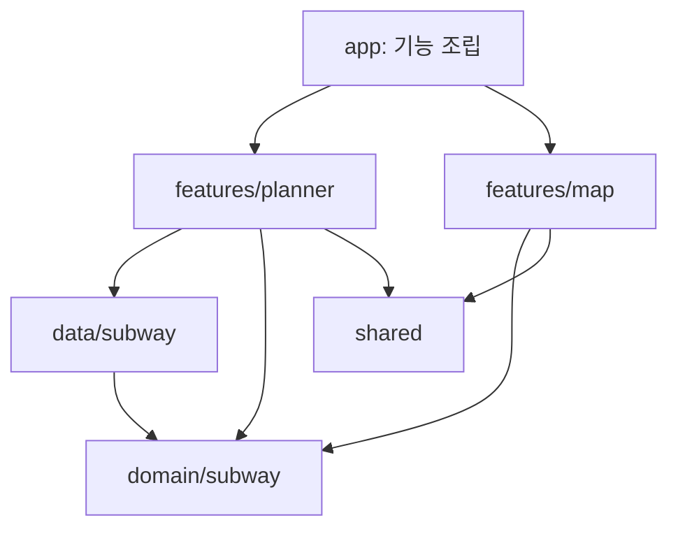

# 아키텍처

[프로젝트 소개](../README.md) · [개발 가이드](DEVELOPMENT.md) · [문서 목록](README.md)

계산 엔진, 생성 데이터, 사용자 기능과 공통 UI의 책임을 나눕니다. 작은 React 앱 규모에 맞춰 기능과 가까운 위치에 코드·스타일·테스트를 둡니다.

## 폴더별 책임

```text
subway-midpoint/
├── .github/                 CI·배포, 이슈·PR 템플릿
├── docs/                    구조·개발·운영 문서
├── scripts/                 데이터 생성·문서 검증 도구
├── src/
│   ├── app/                 앱 조립과 전역 스타일
│   │   ├── App.tsx
│   │   └── styles/          reset·디자인 토큰·앱 레이아웃
│   ├── domain/subway/       UI와 독립된 그래프·최단경로·후보 계산
│   ├── data/subway/         생성 데이터·노선 메타데이터·카탈로그 초기화
│   ├── features/
│   │   ├── planner/
│   │   │   ├── model/      reducer·계산 훅·상태 테스트
│   │   │   └── ui/         역 입력·결과 카드·노선 배지·CSS Modules
│   │   └── map/
│   │       ├── api/        Kakao SDK 로더·타입 선언
│   │       └── ui/         지도·마커·경로 렌더링
│   ├── shared/
│   │   ├── ui/             기능에 의존하지 않는 버튼·아이콘
│   │   └── lib/            표시 형식 등 독립 유틸리티
│   └── main.tsx            React 진입점
├── CONTRIBUTING.md          개발·검증·PR 기준
└── README.md                프로젝트 소개와 탐색 시작점
```

| 새로 추가하는 내용 | 위치 | 이유 |
| --- | --- | --- |
| 경로 계산 규칙 | `domain/subway` | 브라우저·React 없이 검증할 수 있는 순수 로직 |
| 노선 데이터·생성 결과 | `data/subway` | 코드의 판단 규칙과 입력 데이터를 분리 |
| 출발지 상태·계산 호출 | `features/planner/model` | 상태 전이와 화면 렌더링의 책임 분리 |
| 검색·결과 UI | `features/planner/ui` | 사용하는 상태와 도메인이 같은 기능 내부에 위치 |
| 외부 지도 SDK 연동 | `features/map/api` | SDK 로딩과 타입을 지도 UI에서 분리 |
| 공통 버튼·아이콘 | `shared/ui` | 노선 데이터나 특정 기능을 모르는 UI |
| 전역 레이아웃·테마 | `app/styles` | 앱 전체에서 한 번 적용하는 스타일 |

노선 배지는 노선 메타데이터에 의존하므로 공통 UI가 아닌 planner 기능 안에 둡니다. 테스트는 대상 구현 옆에 `.test.ts`로 두고, 생성 데이터 검증은 데이터 폴더에서 수행합니다.

## 의존 관계



- `domain`은 React, 앱·기능 UI와 생성 데이터에 의존하지 않습니다. 실제 데이터로 확인하는 통합 성격의 테스트는 예외입니다.
- `shared`는 앱·기능·지하철 데이터에 의존하지 않습니다.
- planner와 map은 직접 서로를 호출하지 않습니다. `App.tsx`가 계산 결과를 지도 입력으로 변환합니다.
- `data`는 도메인의 타입과 그래프·카탈로그 생성 함수를 사용합니다.

주요 경계는 [ESLint 설정](../eslint.config.js)의 import 규칙으로 검사합니다. 파일 이동 시 import와 [문서 링크](../scripts/check-docs.mjs)를 함께 확인합니다.

## 데이터와 실행 경계

외부 OSM 데이터는 [수집 스크립트](../scripts/fetch-stations.mjs)로 미리 받아 TypeScript 파일로 생성합니다. 앱은 번들에 포함된 데이터를 사용해 브라우저에서 계산하므로 검색할 때마다 Overpass API를 호출하지 않습니다.

Kakao Maps는 계산 결과를 시각화합니다. 키 누락이나 SDK 오류가 발생해도 planner의 입력과 결과 카드는 사용할 수 있습니다. 자세한 계산 가정은 [개발 가이드](DEVELOPMENT.md#그래프와-시간-가중치), 배포 구성은 [운영 문서](OPERATIONS.md)에 정리했습니다.
