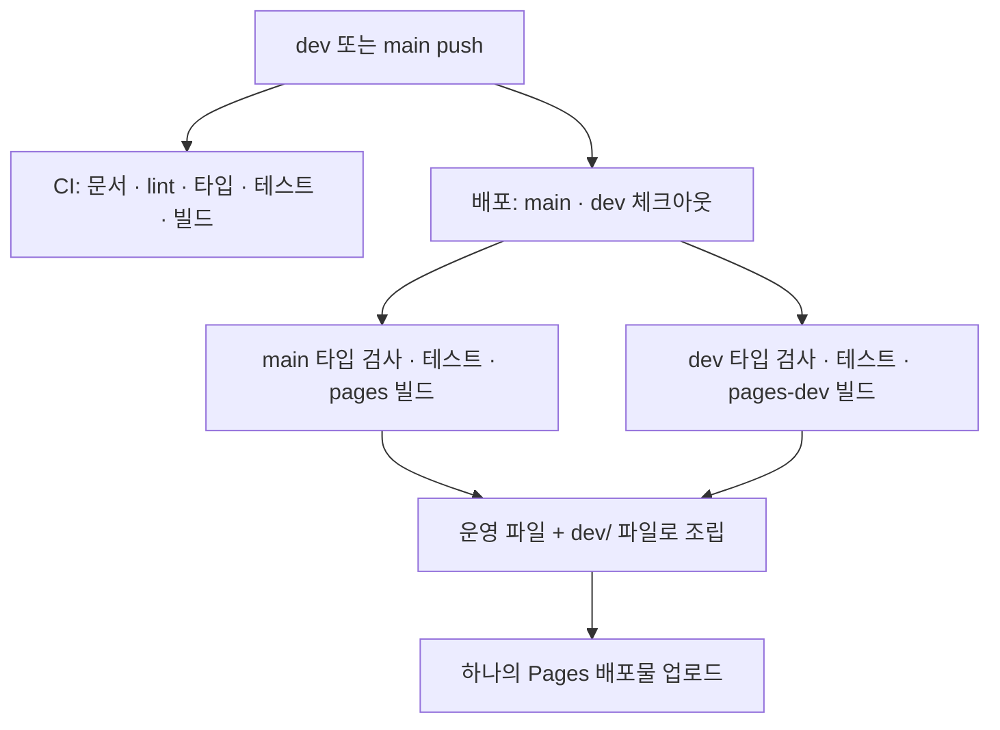

# 운영·배포

[프로젝트 소개](PROJECT.md) · [개발 가이드](DEVELOPMENT.md)

GitHub Pages에 운영과 개발 미리보기를 함께 배포합니다. 문서 기준은 2026-09-27입니다.

## 환경별 주소

| 브랜치 | 역할 | 주소 |
| --- | --- | --- |
| `main` | 운영 | [운영 서비스](https://minsangkwak.github.io/subway-midpoint/) |
| `dev` | 개발 미리보기 | [dev 미리보기](https://minsangkwak.github.io/subway-midpoint/dev/) |

## 지도 설정

로컬에서는 `.env.example`을 `.env`로 복사하고 `VITE_KAKAO_MAP_KEY`에 카카오 JavaScript 키를 입력합니다. 키가 없어도 역 검색과 계산은 동작합니다.

GitHub Actions에서는 저장소 변수 `KAKAO_MAP_KEY`를 빌드 환경변수 `VITE_KAKAO_MAP_KEY`로 전달합니다. 이 값은 프론트엔드 빌드에 포함되는 JavaScript 키이므로 카카오 측 허용 도메인 설정을 함께 관리합니다.

카카오 개발자 콘솔의 Web 플랫폼에 사용할 사이트 도메인을 등록합니다.

- 로컬: `http://localhost:5173`
- GitHub Pages: `https://minsangkwak.github.io`
- 다른 호스팅을 사용할 경우: 해당 배포 도메인

키 값을 변경하면 재빌드가 필요합니다. 카카오 콘솔의 도메인 허용 설정만 바꾼 경우에는 새로고침해 SDK 응답을 다시 확인합니다.

## CI와 배포 흐름

[CI](../.github/workflows/ci.yml)는 PR과 dev·main push에서 문서 링크, lint, 타입 검사, 테스트와 운영 경로 빌드를 실행합니다.

[배포 워크플로](../.github/workflows/deploy.yml)는 dev·main push 또는 수동 실행으로 시작합니다. **CI와 별도 워크플로**이며, 배포 빌드 자체에도 타입 검사와 테스트가 들어 있습니다. 별도 CI의 성공을 기다리는 의존 관계는 설정되어 있지 않습니다.



GitHub Pages 배포물은 하나이므로 두 브랜치를 함께 빌드합니다. 운영 파일은 사이트 루트, 개발 파일은 `dev/`에 넣어 두 주소를 유지합니다. 어느 브랜치에서 시작한 배포든 실행 당시 두 브랜치의 내용을 가져옵니다.

| 설정 | 현재 값 |
| --- | --- |
| 실행 환경 | Node.js 22, `npm ci` |
| 운영 base | `/subway-midpoint/` |
| 미리보기 base | `/subway-midpoint/dev/` |
| 배포 환경 | `github-pages` |
| 동시 실행 | `pages` 그룹, 새 실행 시 진행 중인 이전 실행 취소 |

GitHub의 `github-pages` 환경 보호 규칙은 배포를 실행할 main·dev 브랜치를 허용해야 합니다. base 경로는 [vite.config.ts](../vite.config.ts)에서 모드별로 설정합니다.

## 일반적인 릴리스 순서

1. dev 변경 후 `npm run check`로 검증하고 커밋·푸시합니다.
2. GitHub Actions의 CI와 배포 결과를 각각 확인합니다.
3. dev 미리보기에서 검색·계산·지도와 화면을 확인합니다.
4. dev → main PR을 검토하고 병합합니다.
5. 운영 배포 완료 후 운영 주소에서 핵심 흐름을 다시 확인합니다.

```bash
gh pr create --base main --head dev
```

문서 변경도 현재 워크플로 조건에서는 CI와 배포를 실행합니다. 문서만 바꿀 때 앱 버전이나 런타임 코드를 함께 수정할 필요는 없습니다.

## 문제가 생겼을 때

| 증상 | 확인할 항목 |
| --- | --- |
| 지도 키 없음 안내 | 로컬 `.env` 또는 저장소 변수 `KAKAO_MAP_KEY`, 변경 후 빌드 여부 |
| SDK 401·지도 로딩 실패 | 카카오 앱의 JavaScript 키와 Web 허용 도메인, 브라우저 네트워크 응답 |
| 배포 환경에서 작업 거부 | `github-pages` 환경의 허용 브랜치와 보호 규칙 |
| 배포 실행이 취소됨 | 같은 `pages` 그룹에 더 최근 실행이 있는지 확인 |
| 하위 경로에서 파일 404 | 운영은 `pages`, 개발은 `pages-dev` 모드로 빌드했는지 확인 |
| 갱신한 역 데이터 테스트 실패 | 원본 정차 순서, 급행 제외, 환승 별칭, 종점과 실제 노선 변경 여부 |

배포 성공과 지도 API 성공은 별도로 확인합니다. 지도 오류가 발생하면 먼저 검색·계산·결과 카드가 동작하는지 확인해 영향 범위를 나눕니다.

## 다른 호스팅에서 실행

기본 `npm run build`는 base `/`로 `dist/`를 생성합니다. Vercel 등 루트 경로 호스팅에서 사용할 수 있으며, 해당 서비스에 `VITE_KAKAO_MAP_KEY`와 카카오 허용 도메인을 별도로 설정해야 합니다. 현재 GitHub Actions의 배포 대상은 GitHub Pages입니다.
